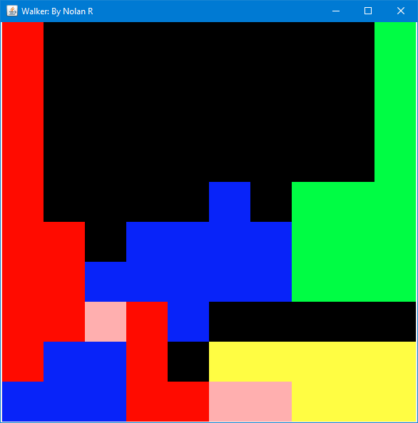
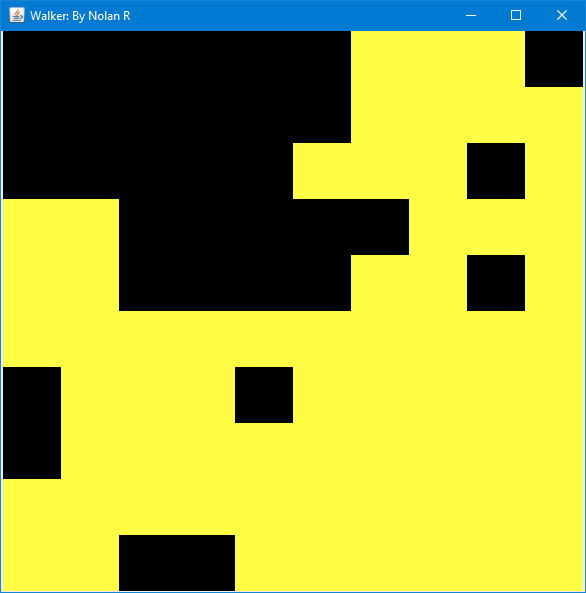

# WalkerGame
Game that Starts with 4 (or more, or less) pawns that randomly traverse a game board until a winner has been decided.

This is what a game in progress looks like

This is what it looks like when somebody wins (Good job, yellow!)

